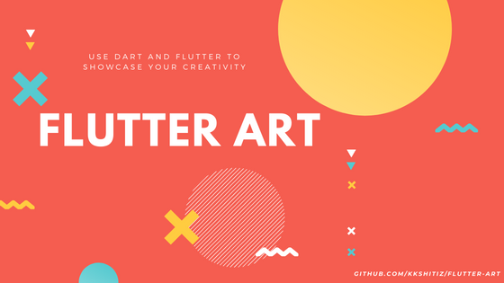
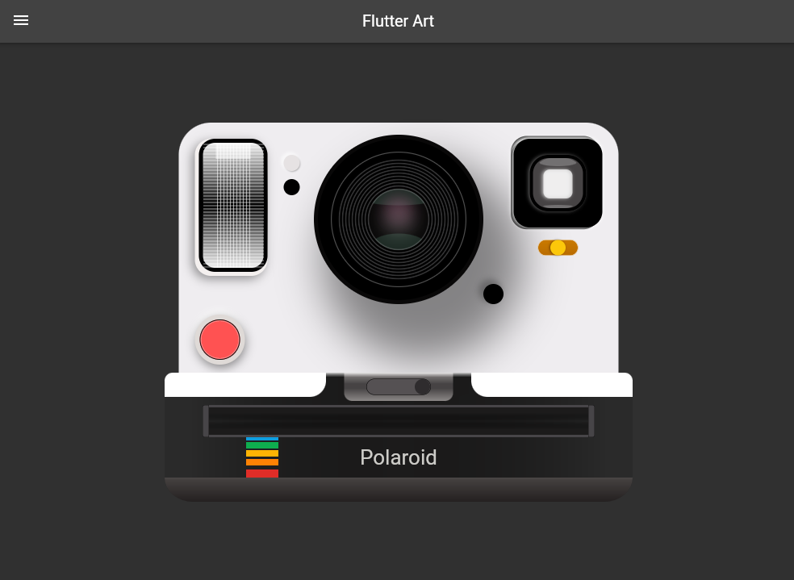
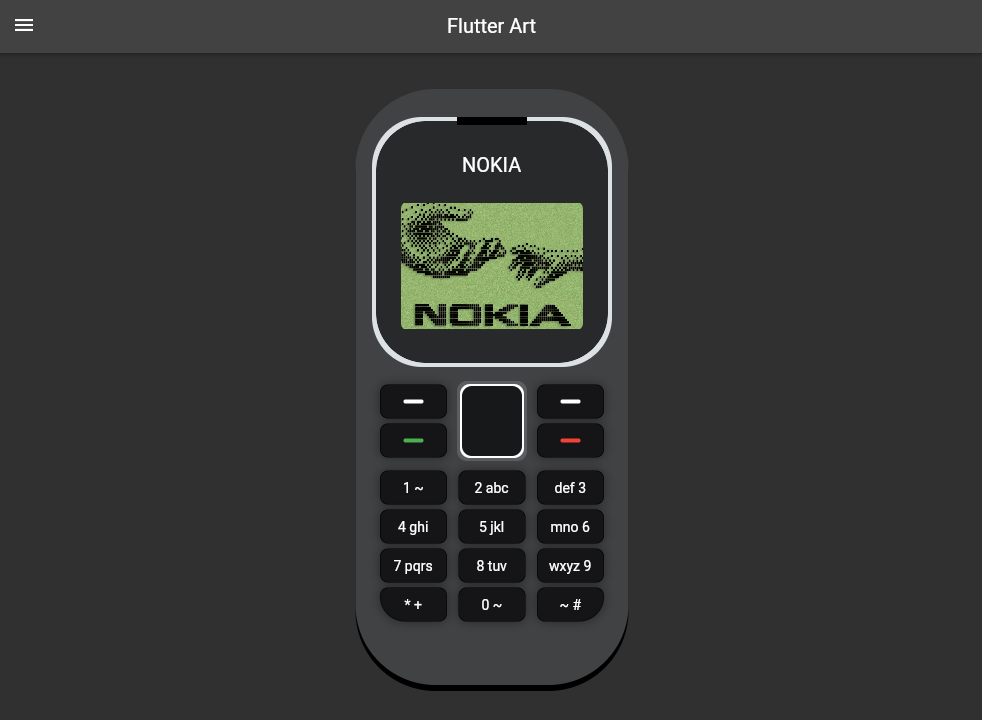
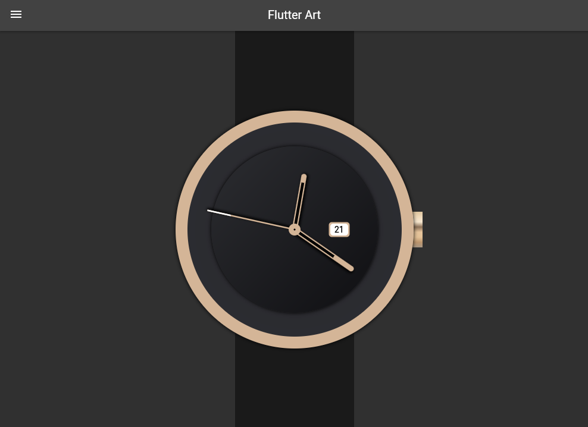

# Awesome Flutter Art    

## Art Gallery

## Some rules and suggestions for making Flutter Art.

1. Please try to avoid using any external package.
2. Add new directory inside lib/art directory for your art.
3. Try to keep it modular, ie split your widgets into mutiple small ones to help keep the code clean.
4. Pay attention to linter warnings and try to resolve them before committing.

Note: Currently, the arts are not responsive. Only web and desktop versions might look good.

## Find inspiration [here](https://css-art.com)
